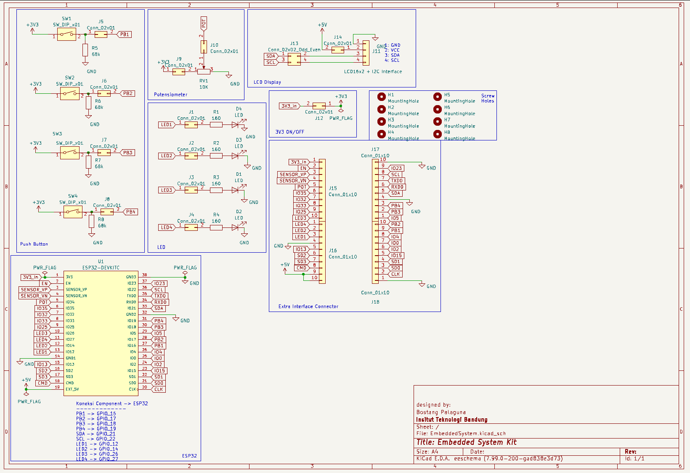
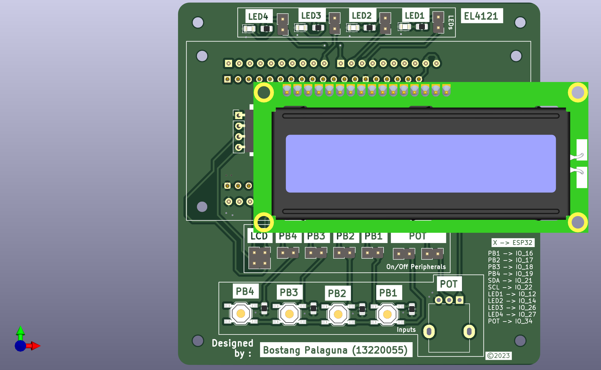
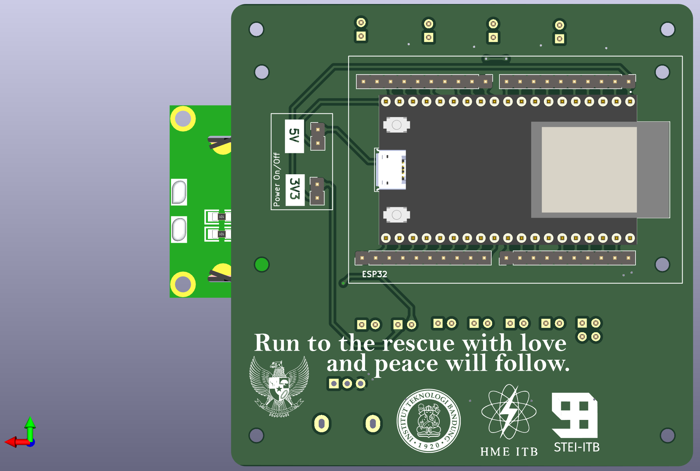
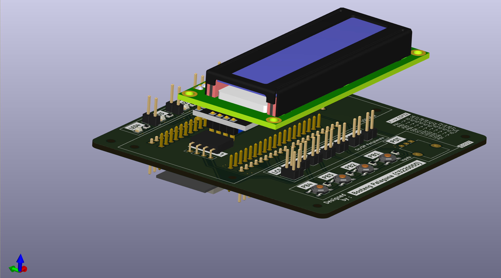

# Embedded System Kit

Programmable ESP-32 development kit untuk tugas-tugas projek mata kuliah EL4121 Perancangan Sistem Embedded.

# Skematik

# Tampilan

## Tampak Atas

## Tampak Bawah

## Bird-view

