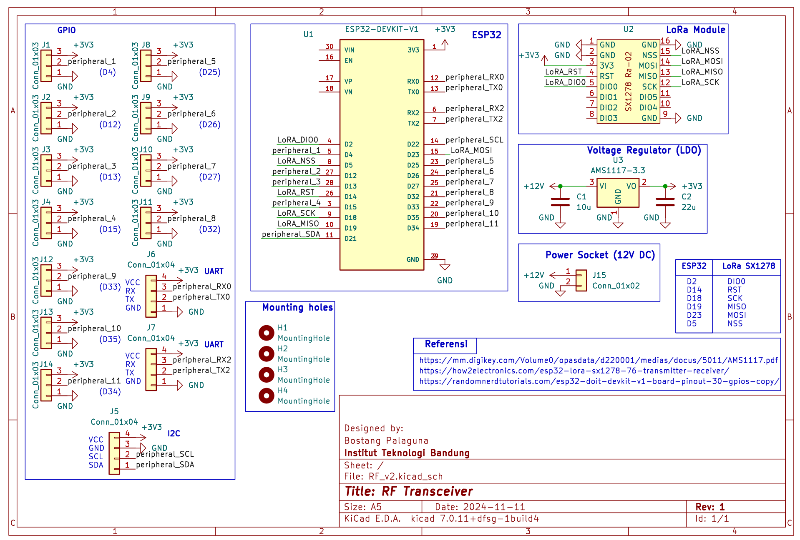
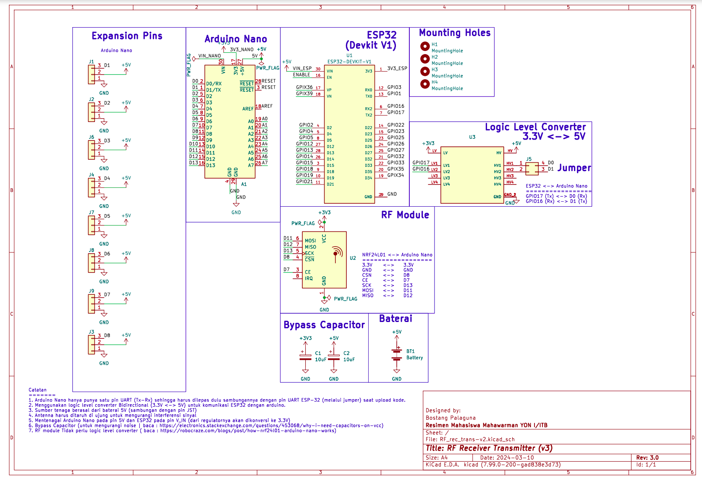
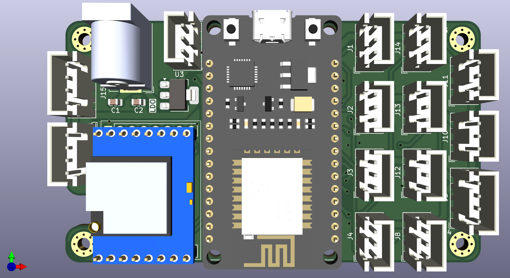
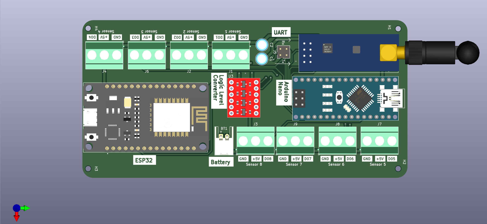
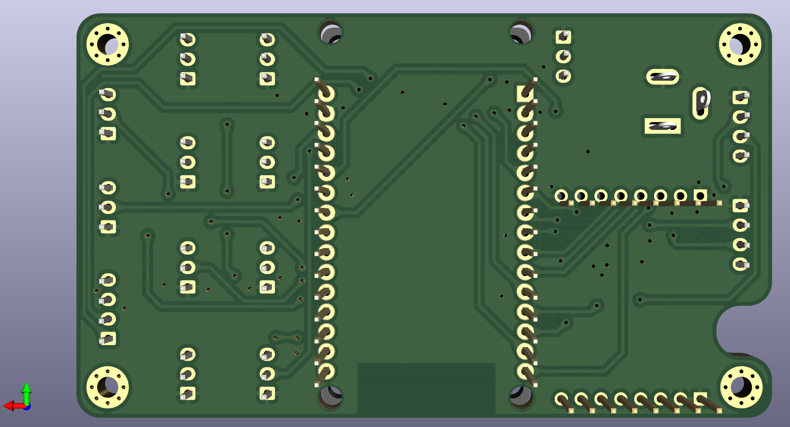
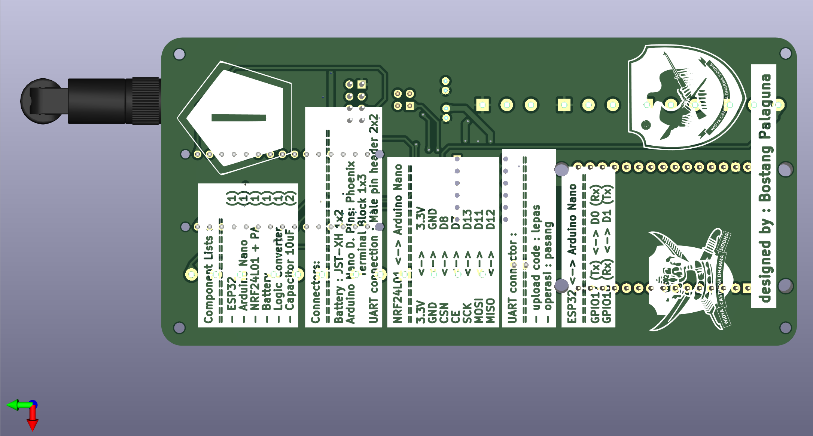
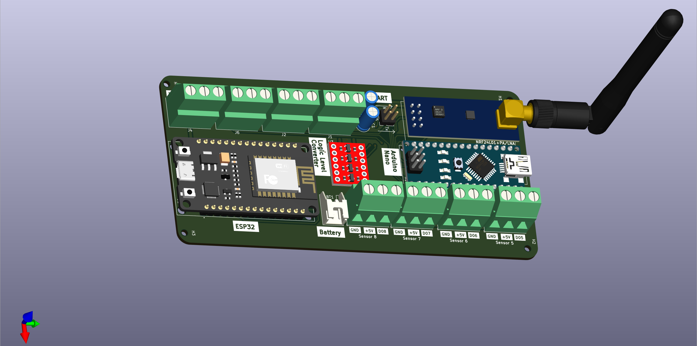

# RF Transceiver

Radio-frequency Transmiter-Receiver menggunakan Arduino Nano, ESP32, dan modul NRF24L01.

# Skematik
## v2

## v1

# Tampilan

## Tampak Atas
## v2

## v1

## Tampak Bawah
## v2

## v1

## Bird-view
## v2

## v1

