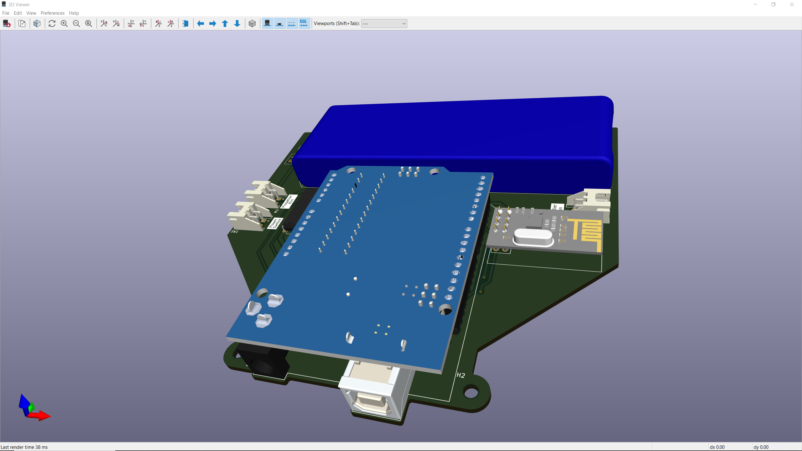

# ROV Controller

robot bawah air yang bergerak dengan dua buah motor 5V DC yang dikendalikan secara nirkabel dengan menggunakan modul NRF24L01

# Skematik

# Tampilan

## Tampak Atas

## Tampak Bawah

## Bird-view

