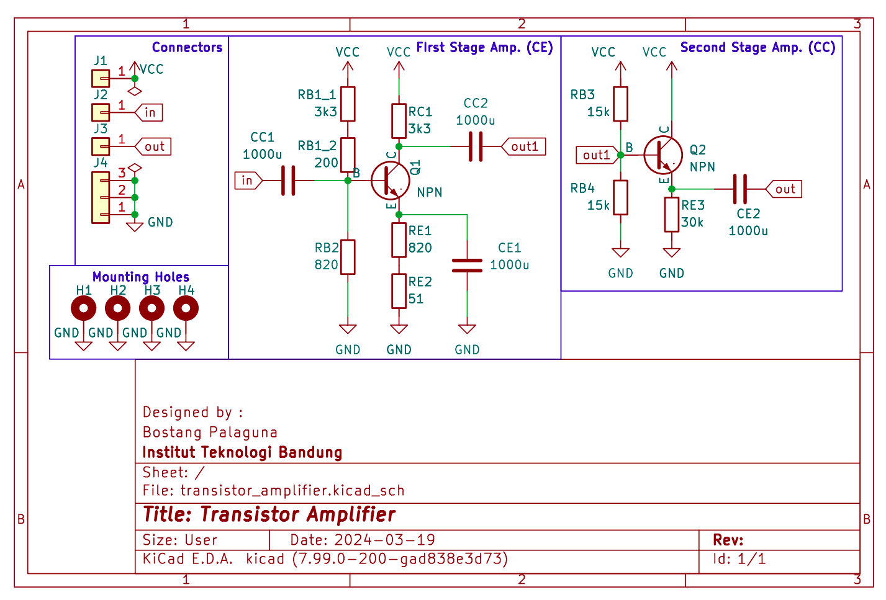
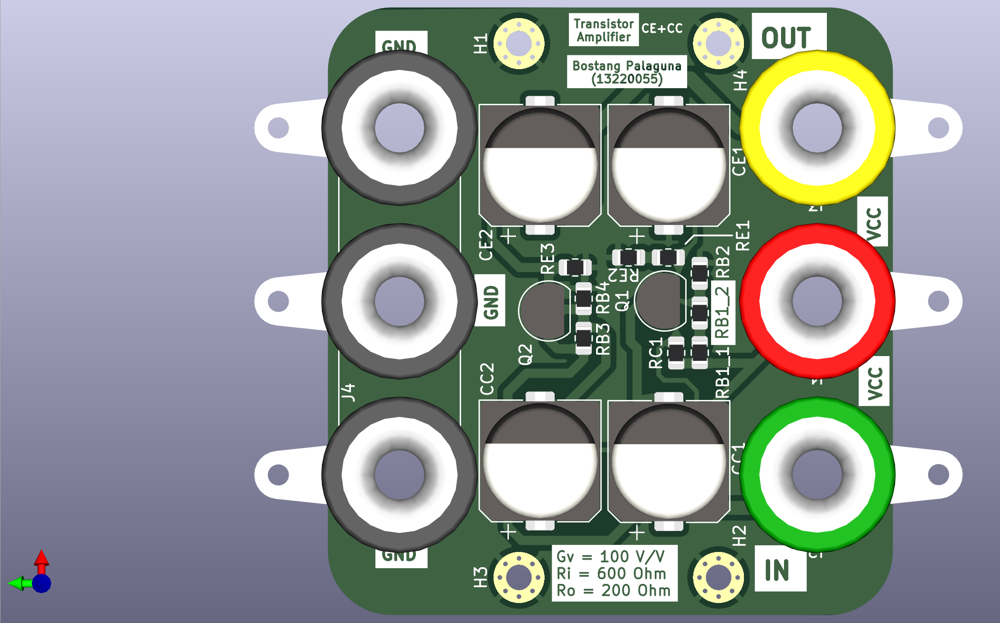
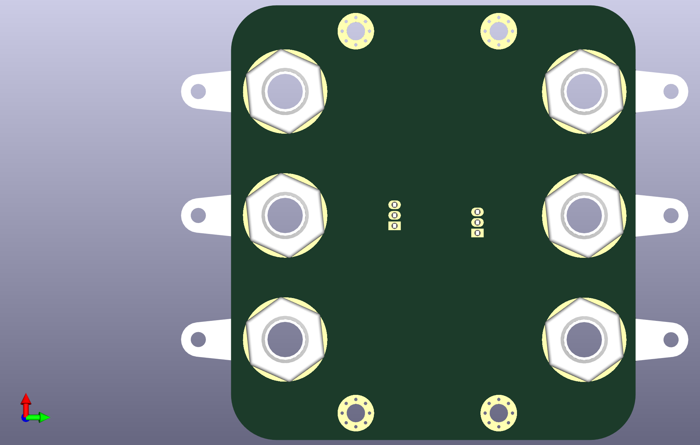
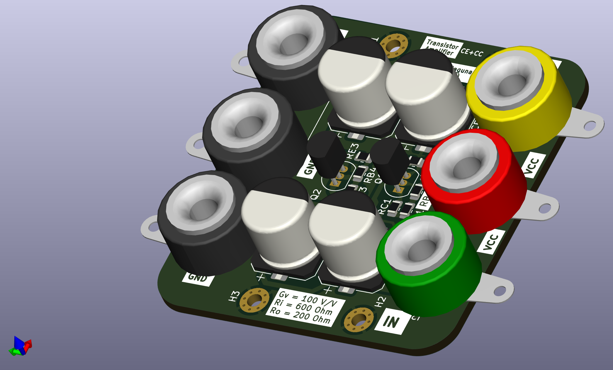

# Transistor Amplifier

Rangkaian Penguat kelas A menggunakan dua buah transistor BJT (konfigurasi common emitter (CE) cascade dengan common collector (CC) untuk tugas besar EL2205 Praktikum Elektronika (first made 2022, but with bad design. recreated 2024).

# Skematik

# Tampilan

## Tampak Atas

## Tampak Bawah

## Bird-view

