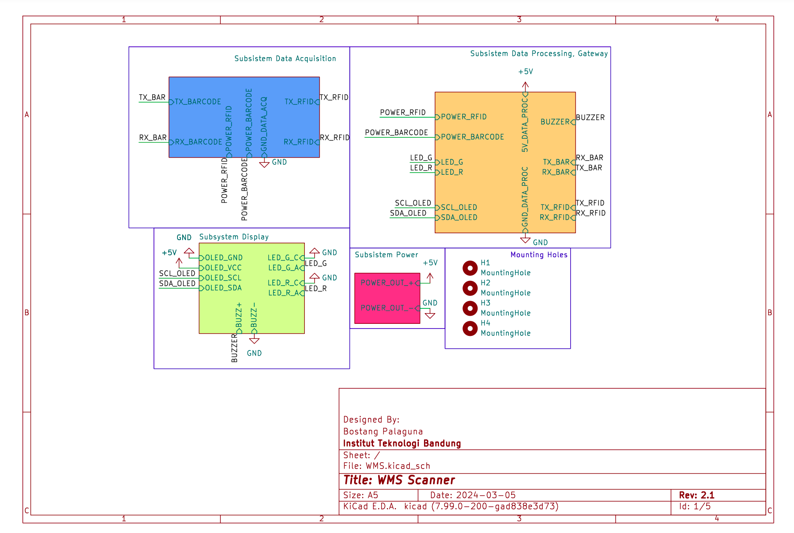
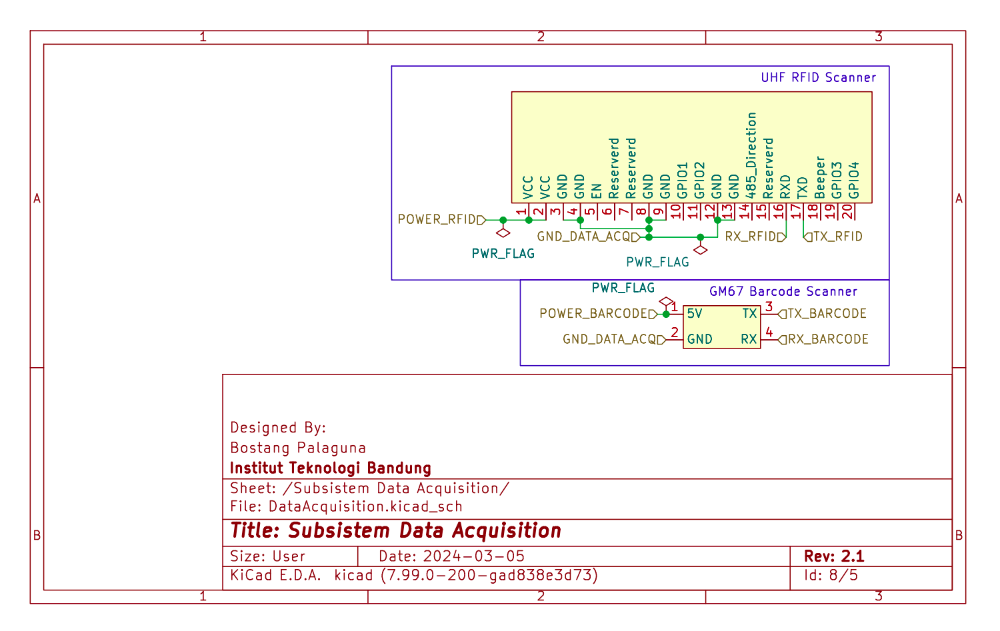
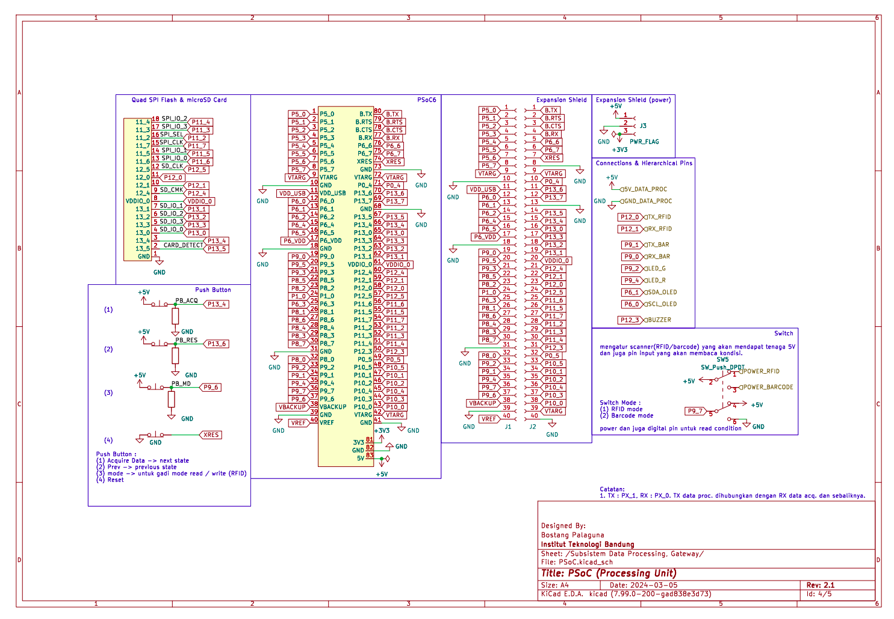
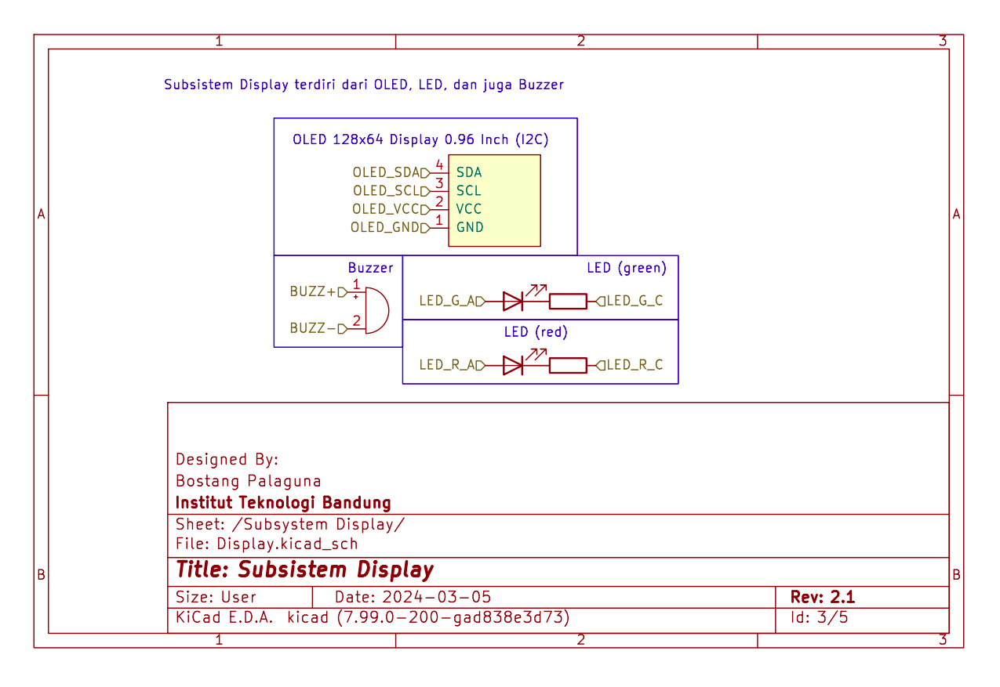
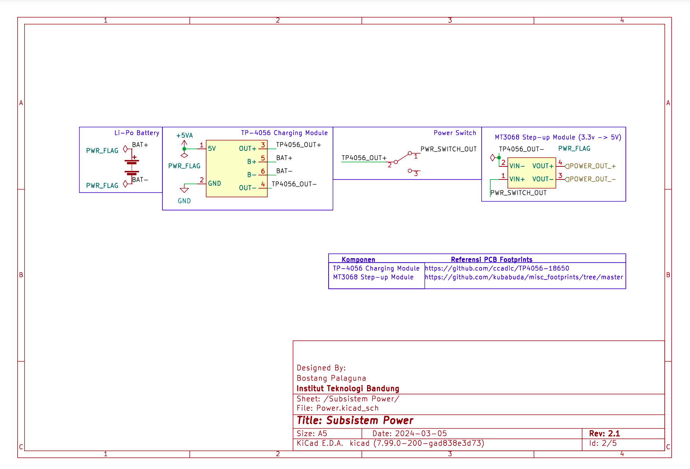
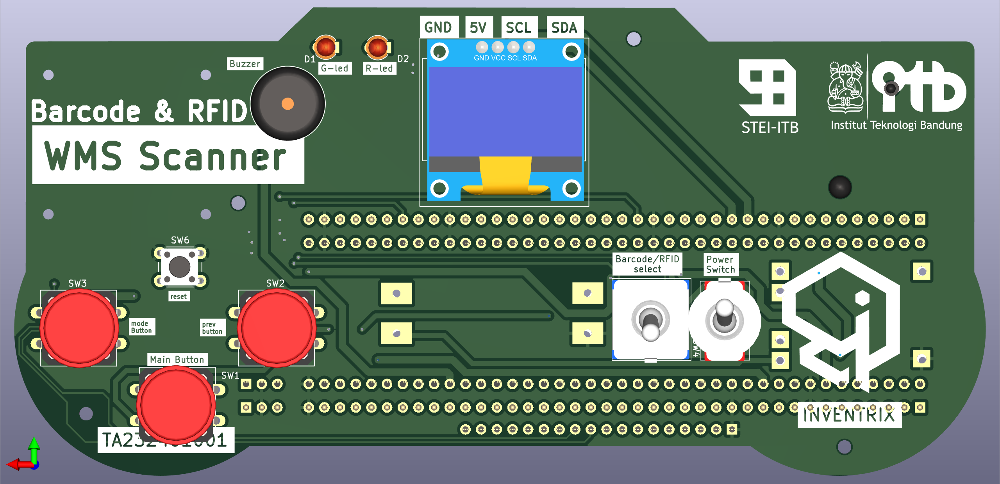
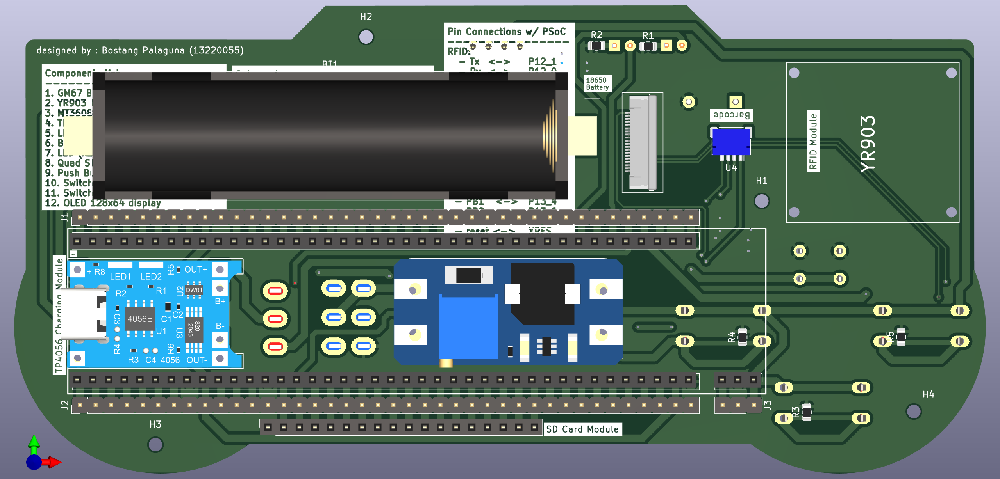
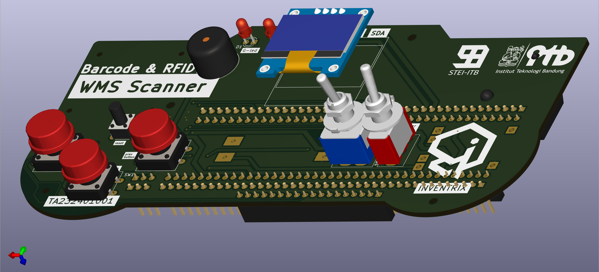

# WMS Scanner

Sebuah perangkat genggam (hand-held device) untuk melakukan scanning kode barang dengan dua mode : barcode dan juga RFID. Proyek ini adalah bagian dari tugas akhir saya

# Skematik

## Top-level

## Sub-sistem : Data Acquisition

## Sub-sistem : Data Processing & Gateway

## Sub-sistem : Display

## Sub-sistem : Power

# Tampilan 3D

## Tampak Atas

## Tampak Bawah

## Bird-view

