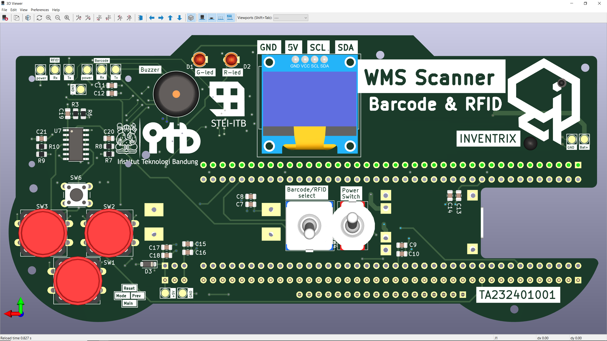
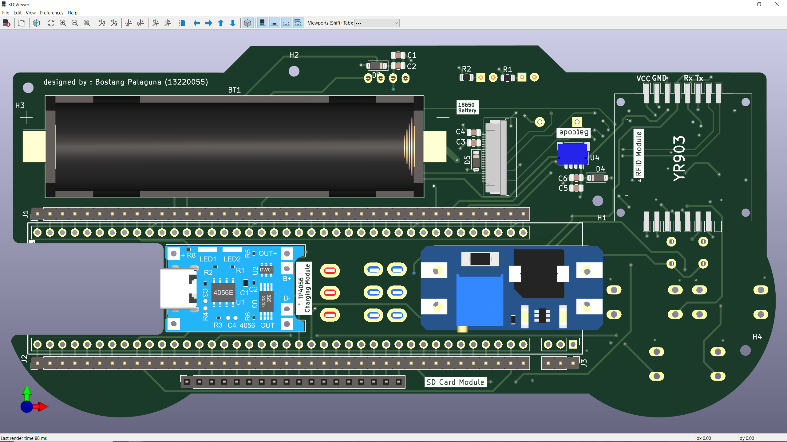
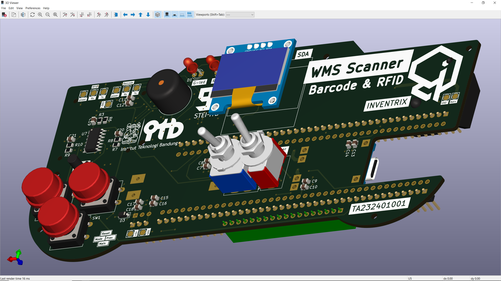
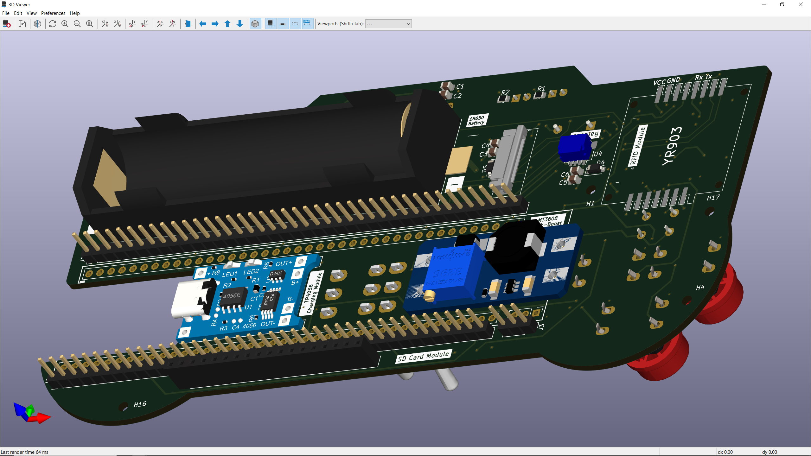

# WMS Scanner

Sebuah perangkat genggam (hand-held device) untuk melakukan scanning kode barang dengan dua mode : barcode dan juga RFID. Proyek ini adalah bagian dari tugas akhir saya

# Skematik

## Top-level

## Sub-sistem : Data Acquisition

## Sub-sistem : Data Processing & Gateway

## Sub-sistem : Display

## Sub-sistem : Power

# Tampilan 3D

## V4

### Tampak Atas

### Tampak Bawah

### Bird-view

## V3

### Tampak Atas

### Tampak Bawah

### Bird-view

# Catatan Perbaikan PCB v4
## v4.0
Berikut adalah beberapa perbaikan yang dilakukan dari PCB v3 ke v4 :
-	PCB dibuat dalam 4 Layer (signal-PWR-GND-signal) untuk mengurangi electromagnetic interference (EMI).
-	Menggunakan banyak kapasitor decoupling untuk mengurangi noise frekuensi tinggi dan rendah.
-	Menggunakan hardware debouncer (Schmitt Trigger + R, C) untuk ketiga push button yang akan rutin ditekan oleh user.
-	Bagian PCB (shield) yang tersambung dengan Antenna PSoC dibuat terbuka untuk meminimialkan masalah jaringan (antenna isolation).
-	Penambahan testing points untuk sinyal-sinyal (Tx-Rx Barcode, RFID, tegangan baterai, dan tegangan keluaran regulator tegangan) untuk debugging.
-	Pengurangan Silkscreen terhadap informasi yang berlebihan dan tidak perlu.
-	Mengubah footprint modul RFID pada bagaian konektor: FPC + solder pad (sebelumnya FPC saja).
-	Penambahan beberapa dioda proteksi (wheeler diode) untuk mencegah spike tegangan saat sakelar power ataupun sakelar barcode-RFID berubah keadaan.
-	Penambahan jumlah mounting hole sebanyak dua buah lagi di titik-titik PCB yang tidak ramai.

## v4.1
-  Memberikan clearance ujung PCB (tidak boleh ada copper plane atau track) minimal 1 mm dari ujung. ==> rawan short di bagian ujung. 
- Setiap berpindah layer menggunakan via, dipasangkan dengan via menuju GND. ==> high speed PCB untuk mengurangi EMI. 
- Memperlebar sedikit ujung papan PCB untuk mengurangi pengaruh medan elektromagnetik di ujung edge effect. (medan menyebar di forth path dan return path di bawah trace. Signal reflection. 
- Memaksimalkan jarak-jarak antar dua track yang parallel untuk mengurangi cross-talk.
