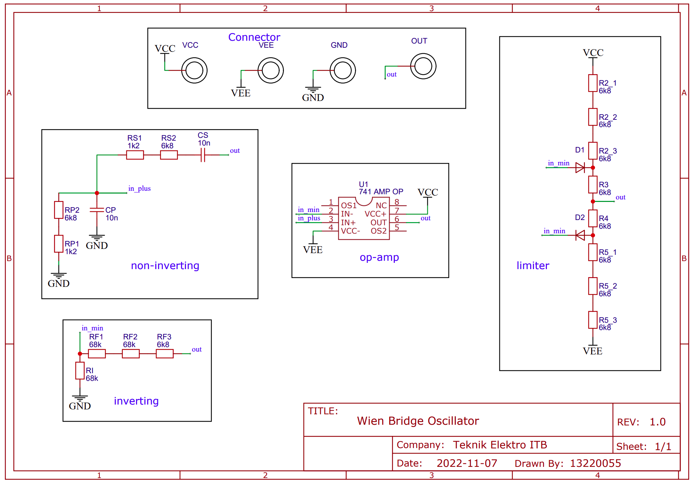
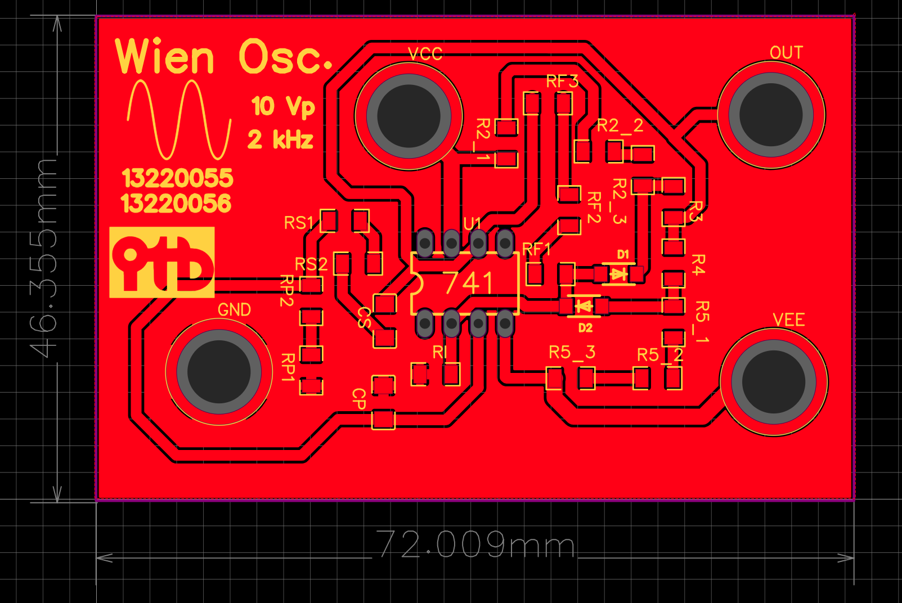

# Wien Bridge Oscillator

Rangkaian Oscillator Wien untuk menghasilkan sinyal sinusoid dengan frekuensi dan amplitudo tertentu dalam rangka memenuhi tugas besar EL3109 Praktikum Elektronika 2 (2023).

# Skematik

# Tampilan

## Tampak Atas

